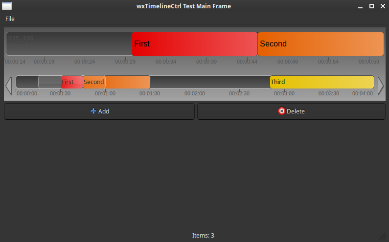

# wxTimelineCtrl

[](https://github.com/T-Rex/wxTimelineCtrl/actions)
[](https://github.com/T-Rex/wxTimelineCtrl/actions)
[](https://t-rex.github.io/wxTimelineCtrl/)
[](LICENSE)
[](https://en.cppreference.com/w/cpp/17)
[](https://www.wxwidgets.org/)

A powerful, interactive timeline control component for wxWidgets applications. This project provides both a reusable library and a sample application demonstrating its capabilities.



## 📋 Table of Contents

- [Features](#features)
- [Quick Start](#quick-start)
- [Project Structure](#project-structure)
- [Building the Project](#building-the-project)
- [Using the Sample Application](#using-the-sample-application)
- [Library Usage](#library-usage)
- [Documentation](#documentation)
- [Development](#development)
- [Continuous Integration](#continuous-integration)
- [Troubleshooting](#troubleshooting)
- [License](#license)

## ✨ Features

- **Interactive Timeline Control**: Drag, zoom, and pan through timeline data
- **Dual View System**: Main timeline view with overview scroller
- **Item Management**: Add, move, resize, and delete timeline items
- **Smart Insertion**: Detached drag mode with automatic item shifting
- **Template-Based**: Generic template design for custom data types
- **Header-Only Library**: Easy integration into existing projects
- **Cross-Platform**: Built on wxWidgets for Windows, macOS, and Linux
- **CMake Build System**: Modern, professional build configuration


## 🚀 Quick Start

### Prerequisites

1. **CMake** (version 3.16 or higher)
2. **wxWidgets** (version 3.0 or higher)
3. **Visual Studio** (2019 or 2022) or another C++ compiler
4. **WXWIN environment variable** set to your wxWidgets installation path

### Build and Run

```bash
# Set up wxWidgets (Windows)
set WXWIN=C:\path\to\your\wxWidgets

# Navigate to project directory
cd wxTimelineCtrl_github

# Verify setup
cd build
verify_setup.bat

# Build the project
build.bat Release

# Run the sample application
cd generated/Release
wxTimelineCtrlTest.exe
```

## 📁 Project Structure

```
wxTimelineCtrl_github/
├── lib/                       # 📚 Library source files
│   ├── wxTimelineCtrl.h      # Main timeline control header
│   ├── TimelineItemData.h    # Base data class
│   ├── TimelineArtProvider.h # Art provider for drawing
│   └── [other library headers]
├── app/                       # 🎯 Application source files
│   ├── wxTimelineCtrlApp.cpp # Sample application
│   ├── wxTimelineCtrlTestMainFrame.cpp # Main frame
│   ├── SampleData.h          # Sample data implementation
│   └── [other app files]
├── build/                     # 🏗️ CMake build system
│   ├── CMakeLists.txt        # Main CMake configuration
│   ├── lib/CMakeLists.txt    # Library build config
│   ├── app/CMakeLists.txt    # Application build config
│   ├── build.bat             # Windows batch build script
│   ├── build.ps1             # PowerShell build script
│   └── verify_setup.bat      # Setup verification script
├── assets/                    # 🖼️ Screenshots and resources
└── docs/                      # 📖 Documentation
```

## 🔨 Building the Project

### Setting up wxWidgets

Before building, ensure the `WXWIN` environment variable is set:

**Windows (Command Prompt):**
```cmd
set WXWIN=C:\path\to\your\wxWidgets
```

**Windows (PowerShell):**
```powershell
$env:WXWIN = "C:\path\to\your\wxWidgets"
```

**Permanent Setup:**
Add the WXWIN environment variable through:
- Control Panel → System → Advanced System Settings → Environment Variables

### Build Options

#### Option 1: Using Build Scripts (Recommended)

**Windows Batch Script:**
```cmd
cd build
build.bat [Debug|Release]
```

**PowerShell Script:**
```powershell
cd build
.\build.ps1 [-Configuration Debug|Release] [-Platform x64|Win32]
```

#### Option 2: Manual CMake Build

```cmd
cd build
mkdir generated
cd generated
cmake -G "Visual Studio 17 2022" -A x64 ..
cmake --build . --config Release
```

### Build Output

After building, you'll find:

```
build/generated/
├── Release/                   # Release build outputs
│   └── wxTimelineCtrlTest.exe # Sample application executable
├── Debug/                     # Debug build outputs (if built)
│   └── wxTimelineCtrlTest.exe # Sample application executable
└── [other build files]
```

## 🎮 Using the Sample Application

The sample application demonstrates all features of the wxTimelineCtrl component.

### Interface Overview

The application window consists of:

1. **Main Timeline View (Top Area):** Large, detailed view for interacting with individual items
2. **Scroller View (Bottom Area):** Overview of the entire time range with draggable viewport
3. **Control Buttons:** "Add" and "Delete" buttons for item management

### Interaction Guide

#### Navigation (Panning and Zooming)

**Panning (Moving Left and Right):**
- **Mouse Wheel:** Hover over main timeline and roll mouse wheel
- **Arrow Keys:** Use Left and Right arrow keys for smooth panning

**Zooming (Changing Detail Level):**
- **Zoom In:** `Ctrl` + `+`
- **Zoom Out:** `Ctrl` + `-`

#### Item Manipulation

**Adding a New Item:**
1. Click the **"Add"** button
2. Configure item properties:
   - **Name:** Text displayed on the item
   - **Start Time & Duration:** Position and length on timeline
   - **Color:** Background color
3. Click "OK" to add the item

**Moving and Resizing Items:**
- **Move Item:** Left-click and drag horizontally to change start time
- **Smart Insert:** Hold `Ctrl` in Scroller View, then drag item - other items automatically shift right

**Deleting Items:**
1. Click **"Delete"** button
2. Select items to delete in the confirmation dialog
3. Click "OK" to remove permanently
- **Alternative:** Use `Delete` key on keyboard

**Context Menu:**
- **Right-click** on selected item in main timeline for context menu with delete option

## 📚 Library Usage

The wxTimelineCtrl library is designed as a header-only library for easy integration into your own projects.

### CMake Integration

#### Method 1: Add as Subdirectory

```cmake
# In your CMakeLists.txt
add_subdirectory(path/to/wxTimelineCtrl/build/lib)
target_link_libraries(your_target PRIVATE wxTimelineCtrl_Lib)
```

#### Method 2: Copy Headers

1. Copy the library headers from `lib/` directory to your project
2. Include the headers in your source files
3. Link against wxWidgets

### Basic Usage Example

```cpp
#include "wxTimelineCtrl.h"      // From lib/ directory
#include "TimelineItemData.h"    // Base data class

// Define your custom data class
class MyTimelineData : public TimelineItemData
{
public:
    MyTimelineData(const wxString& name, int startSeconds, int endSeconds) 
        : TimelineItemData(startSeconds, endSeconds), m_name(name) {}
    
    virtual const wxString& GetName() const override { return m_name; }
    virtual void SetName(const wxString& name) override { m_name = name; }
    
private:
    wxString m_name;
};

// In your frame/window class
class MyFrame : public wxFrame
{
public:
    MyFrame() : wxFrame(nullptr, wxID_ANY, "My Timeline App")
    {
        // Create the timeline control
        m_timeline = new wxTimelineCtrl<MyTimelineData>(this, ID_TIMELINE);
        
        // Configure timeline
        m_timeline->SetTotalDuration(300);     // 5 minutes
        m_timeline->SetVisibleDuration(120);   // Show 2 minutes
        m_timeline->SetFirstVisibleTime(0);    // Start at beginning
        
        // Add some sample data
        auto data1 = new MyTimelineData("Task 1", 10, 60);
        auto data2 = new MyTimelineData("Task 2", 80, 150);
        
        m_timeline->AddItem(data1, *wxBLUE);
        m_timeline->AddItem(data2, *wxGREEN);
        
        // Layout
        auto sizer = new wxBoxSizer(wxVERTICAL);
        sizer->Add(m_timeline, 1, wxEXPAND | wxALL, 5);
        SetSizer(sizer);
    }
    
private:
    wxTimelineCtrl<MyTimelineData>* m_timeline;
    enum { ID_TIMELINE = 1000 };
};
```

### Key Classes

#### `wxTimelineCtrl<T>`
The main timeline control template class.

**Key Methods:**
- `SetTotalDuration(int seconds)` - Set total timeline duration
- `SetVisibleDuration(int seconds)` - Set visible time range
- `SetFirstVisibleTime(int seconds)` - Set viewport start time
- `AddItem(T* data, const wxColour& colour)` - Add timeline item
- `RemoveItem(T* data)` - Remove timeline item
- `GetSelectedItems()` - Get selected item indices
- `ZoomToSelection()` - Zoom to fit selected items

#### `TimelineItemData`
Base class for timeline data items.

**Key Methods:**
- `GetStartTime()` / `SetStartTime(int)` - Item start time
- `GetEndTime()` / `SetEndTime(int)` - Item end time
- `GetDuration()` / `SetDuration(int)` - Item duration
- `GetName()` / `SetName(const wxString&)` - Item name (virtual)

#### `TimelineArtProvider`
Customizable art provider for drawing timeline elements.

**Customizable Methods:**
- `DrawBackground()` - Timeline background
- `DrawItem()` - Individual timeline items
- `DrawTimeScale()` - Time scale labels
- `DrawVisibleFrame()` - Viewport indicator

### Events

The timeline control generates the following events:

```cpp
// In your event table
BEGIN_EVENT_TABLE(MyFrame, wxFrame)
    EVT_COMMAND(ID_TIMELINE, wxEVT_TIMELINE_SELECTION, MyFrame::OnTimelineSelection)
    EVT_COMMAND(ID_TIMELINE, wxEVT_TIMELINE_ZOOM, MyFrame::OnTimelineZoom)
    EVT_COMMAND(ID_TIMELINE, wxEVT_TIMELINE_ITEM_DELETED, MyFrame::OnTimelineItemDeleted)
END_EVENT_TABLE()

void MyFrame::OnTimelineSelection(wxCommandEvent& event)
{
    // Handle item selection
    const auto& selectedItems = m_timeline->GetSelectedItems();
    // Process selected items...
}

void MyFrame::OnTimelineZoom(wxCommandEvent& event)
{
    // Handle zoom changes
    int newZoomLevel = event.GetInt();
    // Update UI accordingly...
}

void MyFrame::OnTimelineItemDeleted(wxCommandEvent& event)
{
    // Handle item deletion
    auto* deletedData = static_cast<MyTimelineData*>(event.GetClientData());
    // Clean up data...
}
```

## 📖 Documentation

### API Documentation

Comprehensive API documentation is automatically generated using Doxygen and is available online:

🔗 **[View API Documentation](https://t-rex.github.io/wxTimelineCtrl/)**

The documentation includes:

- **Class Reference**: Complete API documentation for all classes and methods
- **Usage Examples**: Code samples and implementation patterns
- **Integration Guide**: Step-by-step integration instructions
- **Architecture Overview**: System design and component relationships

### Documentation Features

- **Searchable Interface**: Find classes, methods, and topics quickly
- **Cross-Referenced**: Navigate between related components easily
- **Code Examples**: Practical usage examples throughout
- **Modern Theme**: Clean, responsive design with dark/light mode support
- **Auto-Generated**: Always up-to-date with the latest code changes

### Generating Documentation Locally

To generate the documentation locally:

```bash
# Install Doxygen (if not already installed)
# Windows: Download from https://www.doxygen.nl/
# Linux: sudo apt-get install doxygen
# macOS: brew install doxygen

# Generate documentation
doxygen Doxyfile

# Open the generated documentation
# Windows: start docs/html/index.html
# Linux/macOS: open docs/html/index.html
```

### Documentation Updates

The online documentation is automatically updated when:
- Changes are pushed to the `main` branch
- The Doxygen workflow completes successfully
- New API changes are merged

## 🔧 Development

### CMake Targets

The build system creates the following targets:

1. **wxTimelineCtrl_Lib** - Header-only interface library containing the timeline control
2. **wxTimelineCtrl_App** - Sample application demonstrating the timeline control
3. **wxTimelineCtrl_Headers** - Custom target for IDE support (shows headers in project view)

### Build Configuration

#### Build Types
- **Debug** - Includes debug symbols and console output
- **Release** - Optimized build for production

#### Platform Support
- **x64** - 64-bit Windows (default)
- **Win32** - 32-bit Windows

### Custom Build Configuration

You can customize the build by modifying the CMakeLists.txt files:

- **Main CMakeLists.txt** - Overall project configuration
- **lib/CMakeLists.txt** - Library-specific settings
- **app/CMakeLists.txt** - Application-specific settings

## 🔄 Continuous Integration

This project uses GitHub Actions for automated building and testing across multiple platforms.

### Supported Platforms

- **Windows** (latest) - Visual Studio 2022, x64
- **Linux** (Ubuntu latest) - GCC with wxWidgets 3.0/3.2
- **macOS** (latest) - Clang with Homebrew wxWidgets

### Build Matrix

The CI pipeline builds the following configurations:

| Platform | Configuration | Architecture | Status |
|----------|---------------|--------------|--------|
| Windows  | Debug         | x64          | [](https://github.com/T-Rex/wxTimelineCtrl/actions/workflows/build-windows.yml) |
| Windows  | Release       | x64          | [](https://github.com/T-Rex/wxTimelineCtrl/actions/workflows/build-windows.yml) |
| Linux    | Debug         | x64          | [](https://github.com/T-Rex/wxTimelineCtrl/actions/workflows/build-linux.yml) |
| Linux    | Release       | x64          | [](https://github.com/T-Rex/wxTimelineCtrl/actions/workflows/build-linux.yml) |
| macOS    | Debug         | x64          | [](https://github.com/T-Rex/wxTimelineCtrl/actions/workflows/build-macos.yml) |
| macOS    | Release       | x64          | [](https://github.com/T-Rex/wxTimelineCtrl/actions/workflows/build-macos.yml) |

### Build Triggers

Builds are automatically triggered on:
- **Push** to `main`, `master`, or `develop` branches
- **Pull requests** to `main`, `master`, or `develop` branches

### Build Artifacts

Successful builds generate the following artifacts:
- **Windows**: `wxTimelineCtrlTest.exe` and `wxTimelineCtrlTest.pdb`
- **Linux**: `wxTimelineCtrlTest` (executable)
- **macOS**: `wxTimelineCtrlTest` (executable)

Artifacts are available for download from the [Actions tab](https://github.com/T-Rex/wxTimelineCtrl/actions) for 30 days.

### Build Process

1. **Checkout**: Source code is checked out with submodules
2. **Dependencies**: Platform-specific dependencies are installed
3. **wxWidgets**: On Windows, wxWidgets is cached and built if needed
4. **Build**: Project is built using CMake and platform-specific tools
5. **Test**: Executable is verified to ensure successful build
6. **Artifacts**: Build outputs are uploaded for download

### Local vs CI Build

The CI build process is designed to match the local build experience:
- Uses the same CMake configuration
- Runs the same verification scripts
- Produces identical executables

## 🛠️ Troubleshooting

### Common Issues

#### 1. WXWIN not set
**Problem:** `WXWIN environment variable not set`

**Solution:**
- Ensure the WXWIN environment variable points to your wxWidgets installation
- Restart your command prompt/IDE after setting the variable

#### 2. wxWidgets not found
**Problem:** `wxWidgets not found` during CMake generation

**Solution:**
- Verify wxWidgets is properly built and installed
- Check that wxWidgets CMake files are available
- Ensure you're using the correct wxWidgets version (3.0+)

#### 3. Build errors
**Problem:** Compilation errors during build

**Solution:**
- Ensure you have the correct Visual Studio version (2019 or 2022)
- Check that all required dependencies are installed
- Verify C++ standard is set to 17 or higher

#### 4. Missing executable
**Problem:** Built executable not found

**Solution:**
- Check the correct output directory: `build/generated/Release/` or `build/generated/Debug/`
- Ensure build completed successfully without errors
- Try rebuilding with verbose output: `cmake --build . --config Release --verbose`

### Debug Build

For debugging purposes, build with Debug configuration:

```cmd
cd build
build.bat Debug
```

This enables:
- Debug symbols for step-through debugging
- Console output window for logging
- Additional debugging information
- Slower execution with full error checking

### Verification Script

Before building, always run the verification script:

```cmd
cd build
verify_setup.bat
```

This checks:
- CMake installation and version
- WXWIN environment variable
- wxWidgets installation and headers
- Source files presence
- Build directory structure

## 📄 License

This project is provided as-is for educational and development purposes. Please refer to the individual source files for specific licensing terms.

## 💖 Support Open Source Development

If you find this wxWidgets component helpful and would like to support the development of open source wxWidgets libraries and components, consider making a donation. Your support helps maintain and improve this project, and enables the creation of more high-quality wxWidgets tools for the community.

### Why Support?

- 🚀 **Accelerate Development**: Your donations help dedicate more time to improving existing features and adding new ones
- 🐛 **Better Bug Fixes**: Support enables faster response to issues and more thorough testing
- 📚 **Enhanced Documentation**: Contributions help create better examples, tutorials, and API documentation
- 🌟 **New Components**: Support the creation of additional wxWidgets controls and libraries
- ❤️ **Say Thank You**: A simple way to show appreciation for the time and effort put into open source development

### Donate via PayPal

[](https://www.paypal.com/donate/?hosted_button_id=KCVPYB54QAQDC)

**Every contribution, no matter how small, is greatly appreciated and helps keep this project alive and growing!**

*Thank you for using wxTimelineCtrl and for supporting open source wxWidgets development!* 🙏

---

**Happy coding!** 🚀

For questions, issues, or contributions, please refer to the project documentation or create an issue in the project repository.
